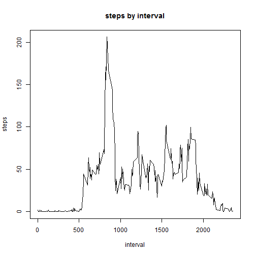

# Reproducible Research: Peer Assessment 1

## Loading and preprocessing the data

For this task we will use the data from a personal activity monitoring device. This device collects data every 5 minutes throughout the day. The data consist of two months of data from an anonymous individual collected over a few months and number of steps taken at 5-minute intervals per day.

In this first block, we will load the data and process it as necessary. The use of the code for this exercise is:


```r
library(data.table)
plan <- fread("activity.csv")
plan$date <- as.Date(plan$date, "%Y-%m-%d")
```

The code is read with the "fread" function of the data.table package. The only processing applied to the dataset is the transformation of the data variable from Character to Date.

## What is the average total number of steps taken per day?

In this exercise, we will generate a histogram of the total number of steps taken each day and calculate the average number of steps taken per day. In this block, the NA values can be ignored.


```r
planSteps <- plan[, lapply(.SD, sum), by = date, .SDcols = "steps"]

par(lend = "square")

plot(planSteps$date, planSteps$steps, 
     type = "h", lwd = 10, col = "black", 
     xlab = "date", ylab = "number of steps",
     main = "number of steps per day")

lines(planSteps$date, planSteps$steps, type = "h", lwd = 7, col = "magenta")
```


```r
mean(planSteps$steps, na.rm = T);median(planSteps$steps, na.rm = T)
```

```
## [1] 10766.19
```

```
## [1] 10765
```

## What is the average daily activity pattern?

We will do a series of times of the interval of 5 minutes (x-axis) and the average number of steps performed, calculating the average every day. Find which 5-minute interval, on average, for all days in the dataset, contains the maximum number of steps.


```r
planSteps2 <- plan[!is.na(plan$steps)][,lapply(.SD, mean), by = interval, .SDcols = "steps"]

plot(planSteps2$interval, planSteps2$steps, type = "l", 
     xlab = "interval", ylab = "steps", 
     main = "steps by interval")
```



```r
planSteps2[which.max(planSteps2$steps)]
```

```
##    interval    steps
## 1:      835 206.1698
```

## Inputing missing values

We will calculate the total number of missing values in the data set. We will devise a strategy to fill in all the missing values in the data set. We will create a new data set without missing values and repeat exercise 1.


```r
length(plan$steps[is.na(plan$steps)])
```

```
## [1] 2304
```

```r
plan$steps[is.na(plan$steps)] <- with(plan, ave(steps, interval, 
                                      FUN = function(x) median(x, na.rm = T)))[is.na(plan$steps)] 
                                      #median substitute missing values 
#Replot "Steps Per Day"
planSteps3 <- plan[, lapply(.SD, sum), by = date, .SDcols = "steps"]

par(lend = "square")

plot(planSteps3$date, planSteps3$steps, 
     type = "h", lwd = 8, col = "black", 
     xlab = "date", ylab = "number of steps",
     main = "number of steps per day")

lines(planSteps3$date, planSteps3$steps, type = "h", lwd = 7, col = "blue")
```


```r
mean(planSteps3$steps, na.rm = T);median(planSteps3$steps, na.rm = T)
```

```
## [1] 9503.869
```

```
## [1] 10395
```


The strategy developed: We replace the missing values by an interval on a specific day by the average value of the steps for the corresponding interval, taking into account every day for which there are measures.

There is a difference between the mean and median values calculated here and those of exercise one. This is simply due to the fact that the median for a significant number of intervals is 0. Before, we were ignoring the missing values that are now subsituted in a significant number of cases by 0. The general effect of this subcession is that both the mean and the median are now smaller and the difference between them is higher.

I used the median instead of the mean because the median is a more appropriate statistical amount.

## Are there any differences in activity patterns between weekdays and weekends?

The results are presented showing the average number of steps in each interval for the week and another for the weekend days.

Now let's create a new variable that indicates whether a particular day is WEEKEND or WEEKDAY. (Using Factor) Next, we measure the number of steps per interval on all weeks and weekends.


```r
library(chron)
library(plyr)
plan$day <- revalue(as.factor(is.weekend(plan$date)), 
                        c("FALSE" = "WEEKDAY", "TRUE"="WEEKEND"))

library(reshape2) 
planMelt <- suppressWarnings(melt(plan, c("interval", "day"))) 
planSumm <- dcast(planMelt, day + interval ~ variable, mean)[,1:3] 

library(lattice)
xyplot(steps ~ interval | day, data = planSumm, layout = c(1,2), type = "l")
```


Although they appear to be very similar, more activity is noticed around midday intervals over the weekend compared to the day of the week. Weekday activity starts a little earlier than the weekend, with a high activity level around 9 o'clock in the morning, probably due to work hours.

It is worth remembering that this analysis was performed with a single individual and a single set of data within this two-month period.

A better analysis that would point to a conclusion could be obtained using the same techniques, as I have described here, but under a group of people and with larger ranges of values.


- Saturday, December 2, 2017
- Porto Alegre/RS, Brasil
- Leonardo Mendes de Oliveira
- Coursera 
